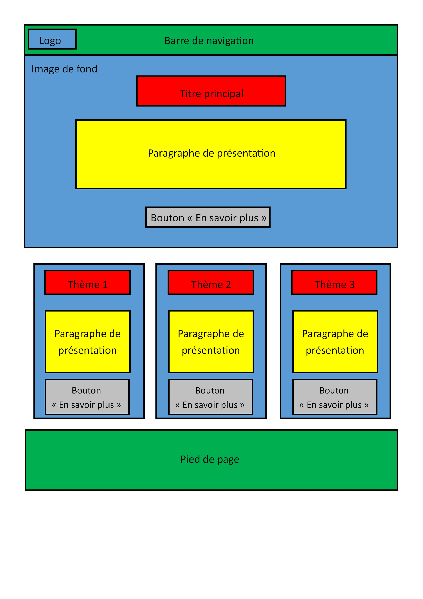
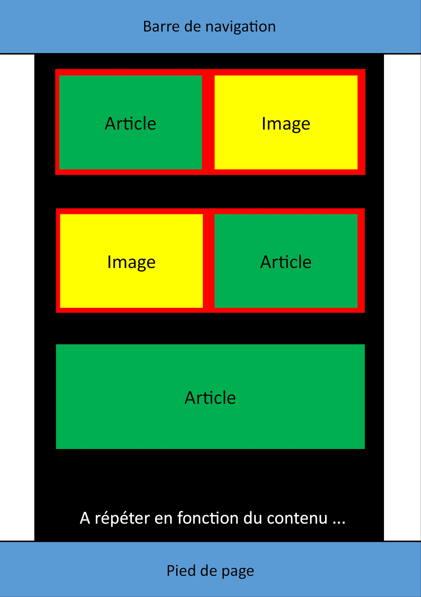
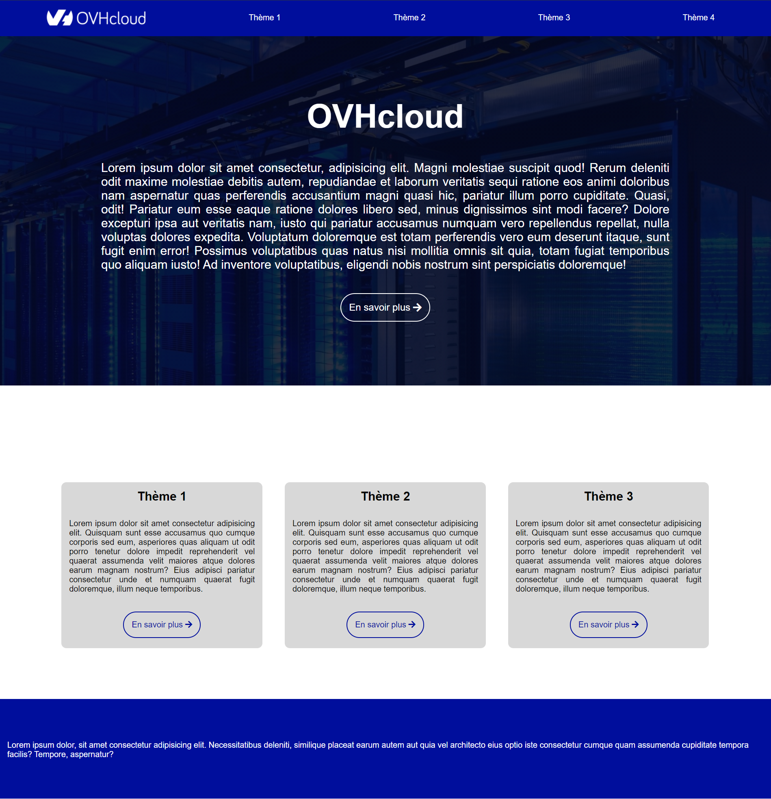
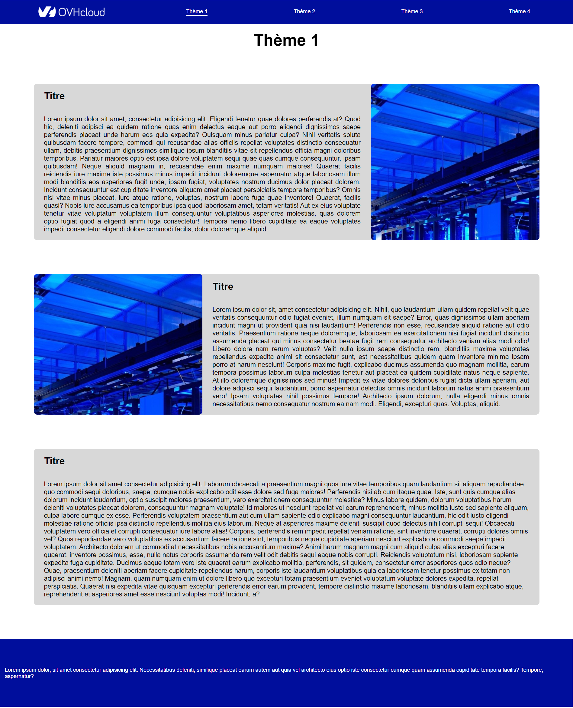

# s1-2021-ihm

---

## Groupe S1-C2
 
 ### membres :
  - Félix RIAT
  - Valentin MOUGENOT
  - Maxence FRECHIN
  - Julien MOURCELY
 
 ### Référent
 [Maxence FRECHIN](mailto:maxence.frechin@edu.univ-fcomte.fr?subject=SAE_1_06)

---
# Livrables :

## Livrable partie Économie
[Livrable économie](doc/S1-C2_Felix-RIAT_Maxence-FRECHIN_Julien-MOURCELY_Valentin-MOUGENOT.pdf)

## Livrables partie WEB

 
### Écran de Zoning 

  + Zoning de la page d'accueil
  
  + Zoning des autres pages
  
 
### Écran prototype
 
  + Écran prototype de la page d'accueil
  
  + Écran prototype des autres pages
  

---

### Rédaction des pages web

> Félix RIAT
>  * Page présentation de l'entreprise

> Julien MOURCELY
>  * Page Stratégie et économie

> Valentin MOUGENOT
>  * Page Accueil
>  * Page Service de l'entreprise
>  * Page Historique

> Maxence FRECHIN
>  * Page Organisation interne

---

### Réalisation des différents écrans

> Félix RIAT
>  * Zoning accueil

> Julien MOURCELY
>  * Protoype autres pages

> Valentin MOUGENOT
>  * Prototype accueil

> Maxence FRECHIN
>  * Zoning autres pages

---

### Choix des styles :

Pour le site web, nous avons choisi comme couleurs le bleu et le blanc car ce sont les couleurs d'OVHcloud et nous avons ajouté du gris pour lier le tout. Pour l'écran d'accueil, nous avons opté pour une solution moderne qui est de mettre une image en arrière plan qui prenne toute la taille de l'écran. La barre de navigation est la même sur toutes les pages et s'animent lorsqu'on passe la souris sur un onglet. Cela permet de rendre le site plus vivant. Enfin pour ce qui est des pages d'informations nous avons opté pour le texte à côté de l'image, car cela illustre directement nos propos. De plus ces blocs sont espacés pour montrer à l'utilisateur que les informations ne font pas partie du même paragraphe.

---

### Validation des pages 

